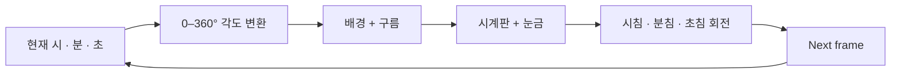

<div align="center">

# ⌚ Smart Watch / p5.js Study

### Time, angles, layers — learned by drawing a clock.

<p>
  
  
  
</p>

[Render Flow](#render-flow) · [What I learned](#what-i-learned) · [Run](#run)

</div>

---

p5.js로 아날로그 시계와 움직이는 구름을 직접 그리면서 **시간 계산, 회전 각도, 프레임 animation, layer order**를 익힌 작은 스케치입니다.

## Render flow



## What I learned

예전에 구름이 시계를 덮는 문제가 있었습니다. 계산 오류가 아니라 **그리는 순서**의 문제였습니다.

```text
Wrong: clock → clouds     = clouds cover the clock
Right: clouds → clock     = clock stays readable
```

구름을 먼저 렌더링하고 마지막에 시계판과 바늘을 그리도록 바꾸면서, canvas에서는 **layer order가 최종 화면을 결정한다**는 걸 직접 확인했습니다.

## Run

`index.html`을 브라우저에서 열면 바로 실행됩니다.

## Stack

`p5.js` · JavaScript · real-time clock · frame animation

> **Learning archive** — 기능을 억지로 현대화하기보다 처음 만든 구조와 배운 내용을 보존합니다.
